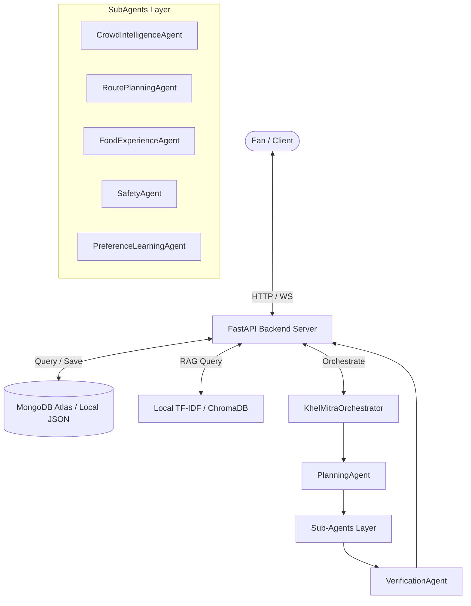

# Product Specification Document (PRD): KhelMitra AI

## 1. Product Overview & Purpose
KhelMitra AI is an intelligent, multi-agent stadium match-day companion application. It is engineered to optimize the fan experience by offering real-time guidance on routing, stadium gates queue times, dietary-tailored culinary options, safety details, and general stadium inquiries. 

The primary purpose is to synthesize live sensors, user historical behavior, and a stadium rule-book knowledge base into a single, cohesive, AI-powered conversational and interactive dashboard.

---

## 2. System Architecture
KhelMitra AI utilizes a decoupled modern web architecture:
- **Frontend**: Single Page Application (SPA) built with React, Vite, and CSS-first styling. Map rendering is powered by `@react-google-maps/api`. Real-time sensor synchronization is achieved via HTML5 WebSockets.
- **Backend**: High-performance asynchronous API service built with FastAPI (Python 3.10+).
- **Database**: MongoDB Atlas cloud database for active schema storage, with zero-dependency local JSON fallbacks for offline development.
- **Orchestration**: A hierarchical Multi-Agent execution graph powered by Google Gemini (using the Gemini API).



---

## 3. Core Features & Capabilities

### 3.1. Planning & Verification Layers
- **PlanningAgent**: Evaluates the user's intent to selectively activate sub-agents, optimizing latency and API cost.
- **VerificationAgent**: Validates outputs produced by sub-agents (e.g., verifying gate existence, ensuring travel times are non-negative, validating food tag matches) before presenting options to the fan.

### 3.2. Sub-Agent Workflows
- **CrowdIntelligenceAgent**: Analyzes stadium gate congestion and recommends the gate with the lowest wait time. Never recommends a gate with a density score greater than `0.8`.
- **RoutePlanningAgent**: Calculates route transit durations, factors in congestion cushion offsets, and determines recommended departure schedules.
- **FoodExperienceAgent**: Filters stadium concessions matching fan dietary restrictions (e.g., vegan, vegetarian, halal).
- **SafetyAgent**: Pinpoints nearest medical booth clinics, emergency exits, and general safety protocols.
- **PreferenceLearningAgent**: Analyzes historical interactions to auto-learn preferred entrance gates and dietary categories.

### 3.3. Retrieval-Augmented Generation (RAG)
- **Knowledge Base**: Consists of local unstructured data files (`stadium_rules.txt`, `parking_info.txt`, `faq.txt`, `emergency_guidelines.txt`, `transport_info.txt`).
- **Retriever Flow**: Uses ChromaDB (or a vectorized local TF-IDF cosine-similarity retriever fallback) to pull top relevant context snippets. Pushes context to Gemini to answer stadium rules questions (e.g., "Can I bring a DSLR?").

### 3.4. Persistent User Memory
- **Database Persistence**: Stores preferred transit modes, dietary settings, crowd tolerance scales, favorite teams, previous routes, and visited venues.
- **Contextual Recall**: Recognizes returning fans (e.g., "I am going to another match") and implicitly customizes their itineraries based on past profile data.

### 3.5. Adaptive Learning Intelligence
- **Feedback Collection**: Tracks accepted/rejected suggestions and records satisfaction scores (1–5) via the `/api/feedback` endpoint.
- **Learning Loop**: If a gate is selected $\ge 2$ times with a rating $\ge 4.0$, it becomes the permanent `preferred_gate`. Similarly, vegetarian preference confidence scales up after consistent selection.
- **Explanations**: Appends reasoning lines explaining *why* a particular gate is recommended (e.g., "preferred by user historically").

### 3.6. Live Stadium Map (Google Maps Integration)
- **Visual Elements**:
  - Displays user current location (Blue dot marker) and stadium location.
  - Draws a route polyline connecting User $\rightarrow$ Stadium.
  - Shows color-coded live Gate markers (Gate A, Gate B, VIP Gate) indicating density thresholds:
    - **Green** marker: `density_score < 0.3` (low crowd)
    - **Yellow** marker: `density_score 0.3 - 0.7` (moderate crowd)
    - **Red** marker: `density_score > 0.7` (heavy crowd)
- **WebSocket Updates**: Subscribes to the `/ws/crowd` channel to receive live telemetry wait-time updates and dynamically recalculates marker colors.
- **Gate Info Window**: Clicking a marker opens a map bubble showing:
  - Gate name
  - Waiting time
  - Live density score
  - Recommendation status (e.g., Recommended vs. Alternative Entry)

---

## 4. REST & WebSocket API Specification

### 4.1. GET /api/venue/{stadium_name}
- **Description**: Returns stadium metadata, including coordinate lat/lng points, concessions list, and gate configurations.
- **Response Format**:
  ```json
  {
    "_id": "603d7dbbf12b543b5c4a45a6",
    "stadium_name": "Wankhede Stadium Mumbai",
    "city": "Mumbai, MH",
    "gates": [
      { "name": "Gate A", "lat": 18.9379, "lng": 72.8248 },
      { "name": "Gate B", "lat": 18.9399, "lng": 72.8268 },
      { "name": "VIP Gate", "lat": 18.9369, "lng": 72.8258 }
    ]
  }
  ```

### 4.2. GET /api/crowd/{stadium_name}
- **Description**: Retrieves live gate wait times (in minutes) for the specified venue.
- **Response Format**:
  ```json
  {
    "Gate A": 42,
    "Gate B": 18,
    "VIP Gate": 3
  }
  ```

### 4.3. POST /api/feedback
- **Description**: Registers fan satisfaction feedback for recommendation learning.
- **Request Body**:
  ```json
  {
    "username": "Alex",
    "accepted_recommendation": "VIP Gate",
    "rejected_recommendation": "Gate A",
    "route_satisfaction": 5,
    "food_satisfaction": 4,
    "gate_satisfaction": 5
  }
  ```
- **Response Format**:
  ```json
  {
    "status": "success",
    "message": "Feedback recorded successfully"
  }
  ```

### 4.4. WebSocket /ws/crowd
- **Description**: Subscribes to live sensor updates.
- **Query Parameter**: `stadium=Stadium Name`
- **Outgoing Message (from server)**:
  ```json
  {
    "type": "crowd_update",
    "stadium": "Wankhede Stadium Mumbai",
    "data": {
      "Gate A": 40,
      "Gate B": 15,
      "VIP Gate": 3
    }
  }
  ```
